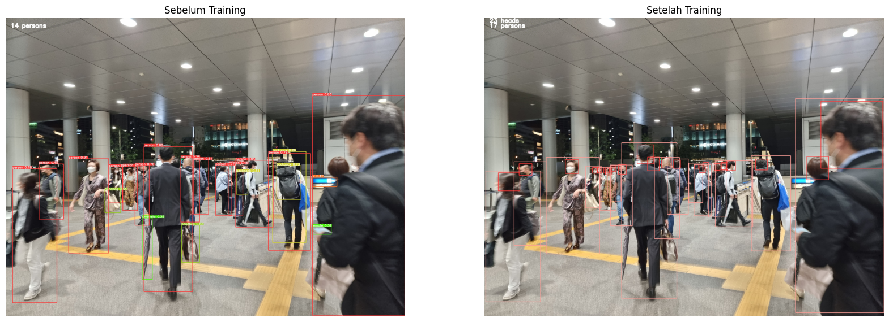

<!-- <div align="center">
  <div>
    <a href="https://github.com/ultralytics/yolov5/actions/workflows/ci-testing.yml"></a>
    <a href="https://zenodo.org/badge/latestdoi/264818686"></a>
  </div>

  <br>
  <p>
    YOLOv5 🚀 is the world's most loved vision AI, representing <a href="https://ultralytics.com">Ultralytics</a>
    open-source research into future vision AI methods, incorporating lessons learned and best practices evolved over thousands of hours of research and development.
    <br><br>
    To request a commercial license please complete the form at <a href="https://ultralytics.com/license">Ultralytics Licensing</a>.
    <br><br>
  </p>
</div> -->

## <div align="center">Documentation</div>

See the [YOLOv5 Docs](https://docs.ultralytics.com) for full documentation on training, testing and deployment. See below for quickstart examples.

<details open>
<summary>Install</summary>

Clone repo and install [requirements.txt](https://github.com/ultralytics/yolov5/blob/master/requirements.txt) in a
[**Python>=3.7.0**](https://www.python.org/) environment, including
[**PyTorch>=1.7**](https://pytorch.org/get-started/locally/).

```bash
git clone https://github.com/CS2019TA/yolov5.git  # clone
cd yolov5
pip install -r requirements.txt  # install
```

</details>

<details>
<summary>Inference</summary>

YOLOv5 [PyTorch Hub](https://github.com/ultralytics/yolov5/issues/36) inference. [Models](https://github.com/ultralytics/yolov5/tree/master/models) download automatically from the latest
YOLOv5 [release](https://github.com/ultralytics/yolov5/releases).

```python
import torch

# Model
model = torch.hub.load('ultralytics/yolov5', 'yolov5s')  # or yolov5n - yolov5x6, custom
# Custom Model
model = torch.hub.load('ultralytics/yolov5', 'custom', 'path/to/weights.pt')  # custom trained model

# Images
img = 'https://ultralytics.com/images/zidane.jpg'  # or file, Path, PIL, OpenCV, numpy, list

# Inference
results = model(img)

# Results
results.print()  # or .show(), .save(), .crop(), .pandas(), etc.
```

</details>

<details>
<summary>Inference with detect.py</summary>

`detect.py` runs inference on a variety of sources, downloading [models](https://github.com/ultralytics/yolov5/tree/master/models) automatically from
the latest YOLOv5 [release](https://github.com/ultralytics/yolov5/releases) and saving results to `runs/detect`.

```bash
python detect.py --source 0  # webcam
                          img.jpg  # image
                          vid.mp4  # video
                          screen  # screenshot
                          path/  # directory
                          'path/*.jpg'  # glob
                          'https://youtu.be/Zgi9g1ksQHc'  # YouTube
                          'rtsp://example.com/media.mp4'  # RTSP, RTMP, HTTP stream
```

</details>

<details>
<summary>Training</summary>

The commands below reproduce YOLOv5 [COCO](https://github.com/ultralytics/yolov5/blob/master/data/scripts/get_coco.sh)
results. [Models](https://github.com/ultralytics/yolov5/tree/master/models)
and [datasets](https://github.com/ultralytics/yolov5/tree/master/data) download automatically from the latest
YOLOv5 [release](https://github.com/ultralytics/yolov5/releases). Training times for YOLOv5n/s/m/l/x are
1/2/4/6/8 days on a V100 GPU ([Multi-GPU](https://github.com/ultralytics/yolov5/issues/475) times faster). Use the
largest `--batch-size` possible, or pass `--batch-size -1` for
YOLOv5 [AutoBatch](https://github.com/ultralytics/yolov5/pull/5092). Batch sizes shown for V100-16GB.

```bash
python train.py --data coco.yaml --epochs 300 --weights '' --cfg yolov5n.yaml  --batch-size 128
                                                                 yolov5s                    64
                                                                 yolov5m                    40
                                                                 yolov5l                    24
                                                                 yolov5x                    16
```


</details>

</details>

## <div align="center">YOLOv5 with CrowdHuman Dataset Result</div>



[assets]: https://github.com/ultralytics/yolov5/releases
[tta]: https://github.com/ultralytics/yolov5/issues/303
